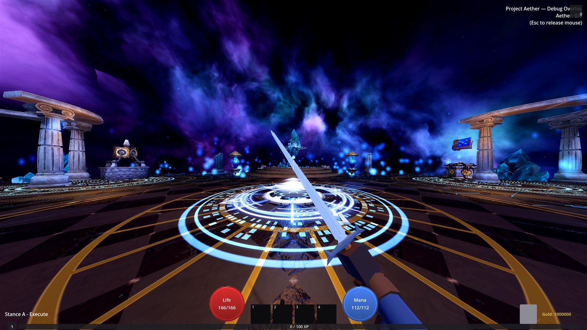

# Project Aether

A first-person action RPG with endgame-first loot and build-crafting, made in Godot 4.7.1.

[](https://discord.gg/8uvrTAZcrS)

You start in the **Memory Nexus**, a hub floating in the void, and step through the Reality Engine into procedurally generated **Figments** full of enemies, loot and bosses. Fight up close with swords, polearms and fists, at range with bows and guns, or with spells channelled through conduits, then bring the loot home to craft and refine your build.



> **Early development build.** Expect rough edges and frequent balance changes.
> Most art and audio are **placeholders made by other creators** and will be
> replaced. See [Credits](#credits).

## Download

Grab the latest build from the [Releases page](https://github.com/bmdearing/Project-Aether/releases/latest).

| Platform | File | Run |
|---|---|---|
| Windows 64-bit | `ProjectAether-<version>-windows.zip` | Unzip, run `ProjectAether.exe` |
| Linux 64-bit | `ProjectAether-<version>-linux.tar.gz` | `tar -xzf` it, run `./ProjectAether.x86_64` |

Each build is a single self-contained executable (about 900 MB to download).

## Features

- **Hub and Figments:** procedurally generated maps (rooms, open fields, canyons), Vault rooms, portals home, and pinnacle bosses.
- **Weighty first-person combat:** light, heavy and charged attacks; parry, riposte and counter hits; hit-stop; and weapon stances for every weapon family.
- **Every weapon feels different:** each weapon family has its own attack, recoil, reload and bow-draw animations, and casters get channelled stances.
- **Ranged weapons:** magazines, reloading, fire modes and spread for pistols, rifles, shotguns, bows and crossbows.
- **Defense:** passive shield block, or an active raised-shield guard that spends Composure.
- **Loot and builds:** rolled gear with affixes, a grid inventory and stash, crafting with orbs and stones, the Fate Board of Slates, and spells levelled with Crystallized Aether.

## Controls

| Action | Key |
|---|---|
| Move / Look | WASD / Mouse |
| Sprint (tap to dash) / Jump / Crouch (tap while sprinting to slide) | Shift / Space / Ctrl |
| Attack: tap for light, hold for heavy | Left Mouse |
| Stance / aim / raise shield (hold) | Right Mouse |
| Parry | F |
| Spells (hold and release to aim targeted spells) | 1-4 |
| Reload | R |
| Swap weapon set (tap) / stance page (hold) | X |
| Interact | E |
| Portal to the Hub | T |
| Inventory / Character / Abilities / Fate Board / Map / Crafting | B / C / N / P / M / K |
| Pause | Esc |

## Building from source

1. Install [Godot 4.7.1](https://godotengine.org/download) (the project uses the Compatibility renderer).
2. Clone this repository and open `project.godot` in Godot.
3. Press F5 to run. The main menu is `ui/main_menu/MainMenu.tscn`.

To export, install the 4.7.1 export templates (Editor > Manage Export Templates), add Windows Desktop and Linux presets, then run:

```
godot --headless --export-release "Windows Desktop" builds/windows/ProjectAether.exe
godot --headless --export-release "Linux" builds/linux/ProjectAether.x86_64
```

## Project layout

| Folder | Contents |
|---|---|
| `entities/` | Player, enemies, projectiles, interactables |
| `systems/` | Combat, abilities, equipment, crafting, inventory, level generation |
| `data/` | Weapons, armor, shields, abilities, enemies, stances (`.tres` resources) |
| `levels/` | Hub, generated maps, boss arena, main-menu background |
| `ui/` | HUD, inventory, character screen, Fate Board, menus |
| `autoloads/` | Game state, events, saving, constants |
| `tests/` | Headless test suites (`godot --headless --path . res://tests/<suite>.tscn`) |
| `tools/` | Warcraft III MDX-to-glTF model converter |

## Community

Come chat, share feedback and report bugs on the [Project Aether Discord](https://discord.gg/8uvrTAZcrS). Bug reports are also welcome as [GitHub issues](https://github.com/bmdearing/Project-Aether/issues).

## Documentation

- [`DEVELOPMENT.md`](DEVELOPMENT.md): system-by-system reference, numbers sourced from the design docs, and open design gaps
- [`PATCH_NOTES.md`](PATCH_NOTES.md): full change history
- `documents/`: design documents

## Credits

Code and design by [bmdearing](https://github.com/bmdearing).

**All third-party art and audio in this project are placeholders.** They belong to their creators, are not owned by this project, and will be replaced with original or properly licensed assets as soon as possible. Full attribution is in [`CREDITS.md`](CREDITS.md). Highlights:

- Weapon models: Low Poly Weapon Pack by Kickin It Studios
- Character, enemy and environment models: Warcraft III custom models by vindorei, Missing Shadowsong, Superfrycook, Mr Ogre man, Fugrim, sadirexi, Raddazong, drew1011, dehme and Shadow44 via [Hive Workshop](https://www.hiveworkshop.com)
- Some props and textures: Warcraft III: Reforged. Warcraft is a trademark of Blizzard Entertainment, Inc.
- Animations: Universal Animation Library by [Quaternius](https://quaternius.com) (CC0)

If you created something used here and want it credited differently or removed, please [open an issue](https://github.com/bmdearing/Project-Aether/issues).
